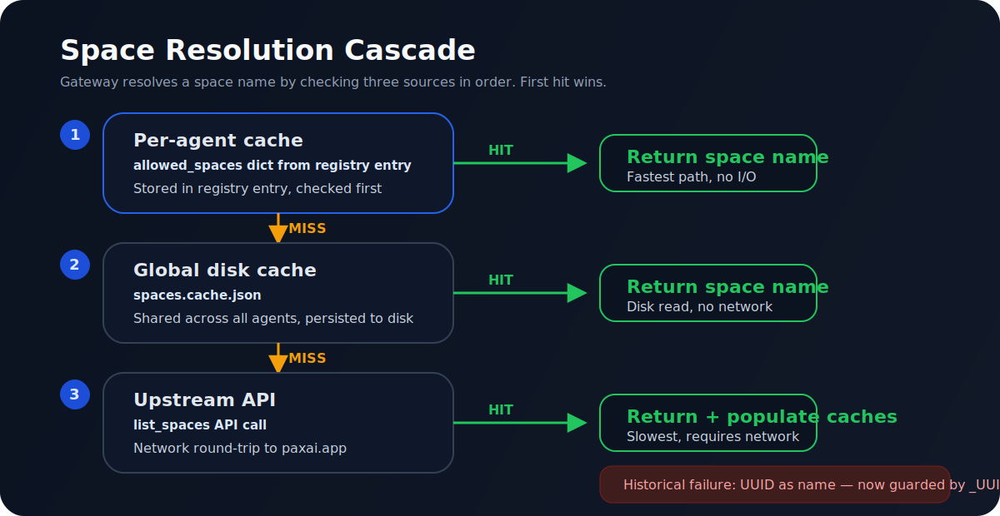
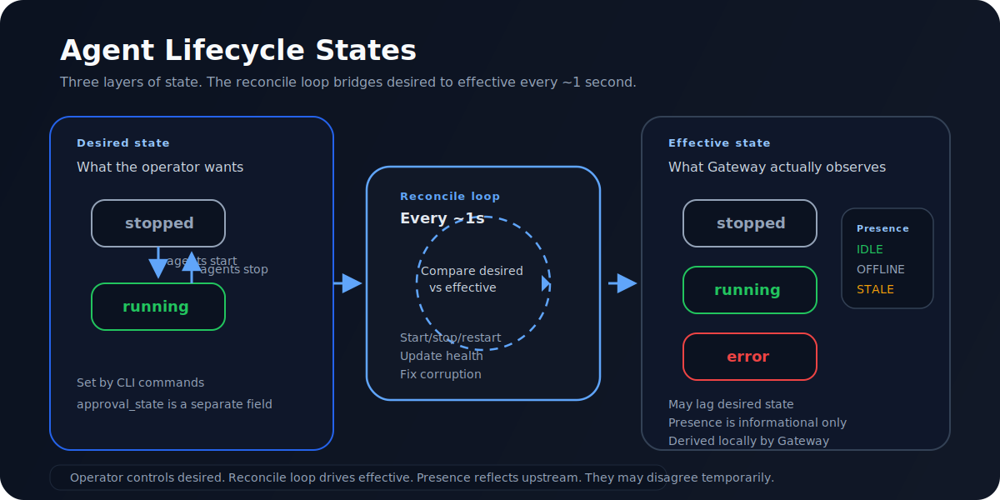

# Gateway Agent Runtimes

Gateway is the management plane for local agents. It should not force every
agent brain into a new runtime shape.

The proven local setup before Gateway was:

- Long-running sentinel listeners in `/home/ax-agent/agents`, launched by
  scripts such as `start_hermes_sentinel.sh`.
- Hermes-backed coding agents using `claude_agent_v2.py --runtime hermes_sdk`
  with Codex/OpenAI models.
- Claude Code sessions connected through `axctl channel` using agent-bound
  profiles.
- Per-agent workdirs, notes, and local instructions under
  `/home/ax-agent/agents/<name>/`.

Gateway keeps those pieces, but moves operator management into one place:

- Mint and store agent-bound credentials.
- Bind identity to device, workdir, runtime type, and launch spec.
- Start, stop, and observe local runtimes.
- Show liveness, queue state, activity, and tool signals.
- Provide a single CLI/UI for dev, staging, and production operators.

Use separate Gateway state per environment. `AX_GATEWAY_ENV=dev` stores
state under `~/.ax/gateway/envs/dev`, while `AX_GATEWAY_ENV=prod`
stores a separate registry, session, PID file, UI state, queues, and agent token
files. `AX_GATEWAY_DIR=/path/to/gateway-state` is available when a deployment
needs an explicit state root.

Managed-agent token paths are stored in `registry.json` **relative to the
gateway state dir** (`agents/<name>/token`) and resolved against it at read
time, so a registry stays portable across hosts and containers — bind-mount the
state dir at a different absolute path (e.g. a macOS host's `~/ax-agents/...`
mounted into a Linux devcontainer) and the same registry opens without
re-minting. Registries written by older builds carried an absolute path frozen
at mint time; those are healed automatically on load (see
[Corruption repair](#corruption-repair)).

## Current Gateway State

Gateway has enough plumbing to register agents, mint managed agent tokens, show
status, queue passive inbox work, run simple built-in runtimes, run command
bridges that emit `AX_GATEWAY_EVENT` progress lines, and supervise Hermes
sentinels. It preserves the old long-running listener behavior for Hermes
instead of launching a new model process per message.

Current useful modes:

- `echo_test` / `echo`: prove Gateway delivery and UI status.
- `pass_through`: approved polling mailbox identity for agents that check in
  from a local workspace.
- `inbox`: queueing and manual acknowledgement paths for background workers.
- `exec`: run probes or one-shot bridges that explicitly persist or reconstruct
  any state they need.
- `hermes_plugin`: Gateway-supervised long-running `hermes gateway run`
  process using the native aX platform plugin at `plugins/platforms/ax/`.
  Preferred path for all new Hermes agents. Gateway scaffolds
  `<workdir>/.hermes` (plugin symlink + non-secret identity `.env`), spawns
  the hermes binary, and injects `AX_TOKEN` from the Gateway-owned token
  file at start so the raw PAT never lives in the workspace. The `hermes`
  template defaults to this runtime.
- `hermes_sentinel` *(legacy)*: Gateway-supervised long-running Hermes
  listener using the old `claude_agent_v2.py --runtime hermes_sdk`
  behavior. Kept only so existing entries keep working; new agents should
  use `hermes_plugin`. Migrate with
  `ax gateway agents update <name> --type hermes_plugin`.
- `claude_code_channel`: attached Claude Code channel. Gateway registers the
  identity and token; `ax-channel` delivers live mentions into the Claude Code
  session.

Use `hermes_sentinel` for coding sentinel QA. Avoid using a one-shot `exec`
bridge as proof that `dev_sentinel` is fixed. It can prove Gateway dispatch,
but not the session continuity that made the old sentinel setup useful.

## Preferred Runtime Patterns

### Hermes Sentinel

Use Hermes for coding sentinels that need tool use, repo access, session
continuity, and rich activity. On this host, the preferred model family is the
Codex/OpenAI path, for example `codex:gpt-5.5` when available.

The old working launcher shape is:

```bash
/home/ax-agent/agents/start_hermes_sentinel.sh dev_sentinel \
  --runtime hermes_sdk \
  --model codex:gpt-5.5
```

The Gateway-managed shape preserves that runtime behavior:

```bash
ax gateway agents add dev_sentinel \
  --template hermes \
  --workdir /home/ax-agent/agents/dev_sentinel

ax gateway agents start dev_sentinel
ax gateway agents show dev_sentinel
```

Gateway should supervise the long-running listener process. The listener still
owns the Hermes session, runtime plugin, message queue, and tool callbacks. The
Gateway owns the credentials, process lifecycle, binding verification, and
operator status.

Runtime token files must contain an agent-bound credential for the managed
agent. Gateway rejects user bootstrap PATs before sends or runtime launch so a
copied user token cannot become an agent runtime identity.

Do not treat the one-shot `examples/hermes_sentinel/hermes_bridge.py` demo as
the production sentinel pattern. It is useful for proving that a Gateway command
bridge can call Hermes, but it creates a fresh agent per message and does not
match the old sentinel continuity model.

### Claude Code Channel

Use Claude Code channels for agents backed by a Claude subscription. The channel
is an attached live session, not a headless per-message subprocess.

Register the identity through Gateway, then let channel setup read the Gateway
registry row:

```bash
ax gateway agents add orion \
  --template claude_code_channel \
  --workdir /path/to/orion-workspace

ax channel setup orion \
  --workdir /path/to/orion-workspace
```

Claude Code then runs with the generated MCP config:

```bash
cd /path/to/orion-workspace
claude --strict-mcp-config \
  --mcp-config .mcp.json \
  --dangerously-load-development-channels server:ax-channel
```

Gateway knows which local Claude Code channel identity is registered, which
agent-bound token file it uses, and which space it belongs to. The channel
remains responsible for delivering messages into Claude Code and for emitting
`working` and `completed` processing signals.

The `--workdir` is part of the identity boundary. It must be the directory the
agent will run from. Channel setup writes `.ax/config.toml` there for Gateway
CLI access and `.mcp.json` there for Claude Code MCP/channel delivery.

### Command Bridge

Use command bridges for simple adapters, demos, and smoke tests.

```bash
ax gateway agents add echo-bot --template echo_test
ax gateway agents add probe \
  --type exec \
  --exec "python3 examples/gateway_probe/probe_bridge.py" \
  --timeout 120
```

Command bridges are valuable for probes and simple integrations. They are not
the preferred shape for coding sentinels because a per-message command loses
important in-process state unless the bridge explicitly persists and resumes it.
Use `--timeout` / `--timeout-seconds` to cap per-message runtime work. On
timeout, Gateway publishes a terminal `error` processing signal with
`reason=runtime_timeout` and does not mark the message completed or send a fake
success reply.

## Signal Contract

Every inbound message should have a visible delivery signal before the final
reply. This is how operators know work did not disappear into a black hole.

Minimum signals:

- `accepted` or `working`: the runtime received the message.
- `thinking`: the model/runtime started processing.
- `tool_call`: the runtime is using a tool, with a useful tool name or summary
  when available.
- `completed`: the runtime finished and either replied or explicitly queued the
  work.
- `no_reply`: the runtime deliberately declined to answer. Gateway must surface
  this as a terminal "chose not to respond" signal on the original message
  without creating a normal chat reply.
- `error`: the runtime failed or timed out and the operator should inspect logs.

Hermes sentinels should preserve the old behavior from `claude_agent_v2.py`:
tool callbacks update the activity bubble with real work, such as reading a
file, running a command, searching, or writing a note.

Claude Code channels should at least emit delivery and completion. Richer tool
signals depend on what Claude Code exposes through the channel.

## Migration From CLI-Managed Agents

1. Inventory the old agent directory, launcher, workdir, model, and profile.
2. Register the agent in Gateway without changing its platform identity.
3. Mint or attach an agent-bound credential owned by Gateway.
4. Store the launch spec in Gateway: runtime family, workdir, command/profile,
   and expected environment.
5. Start the same runtime through Gateway supervision.
6. Verify that the first inbound message gets a visible pickup/activity signal.
7. Verify continuity with a two-message memory test in the same thread.
8. Keep the old systemd/CLI launcher disabled once Gateway supervision is
   stable, so only one listener receives each message.

The important rule is one live receive path per agent. If the old CLI listener
and Gateway both listen for the same agent identity, messages can route through
different paths and create the stale/missing-context behavior seen during the
Gateway migration.

## Dev Server Notes

For `dev.paxai.app`, prefer building and testing against development agents
first. A good first continuity test is:

```text
@dev_sentinel remember the word cobalt and reply briefly.
@dev_sentinel what word did I ask you to remember?
```

Expected result:

- The original message shows Gateway pickup/working activity quickly.
- The runtime uses the Hermes session from the first turn on the second turn.
- The reply remembers `cobalt`.
- Tool activity appears when the agent reads files, writes notes, or runs
  commands.

If the second reply has no memory of the first, the agent is still being
cold-started per message or messages are reaching multiple receive paths.

---

## Space Resolution



Space resolution is how Gateway determines which space an agent belongs to.
Understanding the cascade prevents the most common operator confusion: seeing a
UUID where a space name should be.

### The resolution cascade

When Gateway needs a space name for an agent, it checks three sources in order:

1. **Per-agent `allowed_spaces` cache** — in-memory, stored in the registry
   entry. Fastest. Populated when the agent first connects or when the operator
   switches spaces.
2. **Global disk cache** (`~/.ax/gateway/spaces.cache.json`) — shared across all
   agents. Falls back here when the per-agent cache is empty. Populated by
   `save_space_cache()` and `upsert_space_cache_entry()` after upstream space
   resolution calls.
3. **Upstream `list_spaces` API call** — slowest, requires network. Used when
   both caches miss.

The key function is `space_name_from_cache(space_id)` in `ax_cli/gateway.py`.
It does id-to-name lookup against the global disk cache.
`lookup_space_in_cache()` handles slug-to-UUID resolution separately.
`_fallback_allowed_spaces()` synthesizes per-agent space rows from
entry/session fields — it does not populate the global disk cache.

### Common failure: UUID-as-name

If the upstream API returns a space record where `name` is a UUID string (a
platform bug or data inconsistency), the per-agent cache stores that UUID as the
"name." The operator then sees a UUID in `agents show`, the UI agent table, and
log messages — confusing but not a functional failure.

**Status:** The `_UUID_RE` guard now validates that a name doesn't look like a
UUID before caching, preventing this at the storage layer.

### Space state storage

Active space state lives in `session.json`, not `registry.json`. This separation
was made in PR #172 to prevent the reconcile loop from racing with operator
space switches. See [ADR-004](adr/ADR-004-space-state-in-session.md).

The auto-migration in the reconcile loop strips stale `space_id`/`space_name`
from the registry gateway block, pushing operators toward the session-based
model.

---

## Agent Lifecycle



Every managed agent has three layers of state. Understanding how they interact
is key to debugging agent issues.

### Three-layer state model

| Layer | What it represents | Who sets it | Example values |
| --- | --- | --- | --- |
| **Desired state** | What the operator wants | `agents start`, `agents stop` | `running`, `stopped` |
| **Effective state** | What Gateway observes locally | Reconcile loop | `running`, `stopped`, `error`, `starting`, `reconnecting` |
| **Presence** | What Gateway derives locally | `_derive_presence()` | `IDLE`, `OFFLINE`, `STALE`, `WORKING`, `QUEUED`, `BLOCKED`, `ERROR` |

The reconcile loop bridges desired to effective. It runs every ~1 second
(default `poll_interval=1.0`) and for each agent:

1. Compares `desired_state` to `effective_state`
2. If they differ, takes action (start process, stop process, restart)
3. Checks health and updates annotations
4. Signals liveness transitions upstream when a delta is detected

Heartbeats originate from the agent runtimes themselves, not from the
daemon sweep. The sweep observes liveness state and reports deltas
upstream, but does not drive the heartbeat cadence.

Presence is informational — Gateway does not use presence to make lifecycle
decisions. An agent can be `effective_state: running` locally but
`presence: offline` upstream if the heartbeat hasn't propagated yet.

### Manual attach

For attached-session agents (Claude Code channels), `agents mark-attached`
forces both `desired_state` and `effective_state` to `running` immediately
(see `_mark_attached_agent_session()` in `commands/gateway.py`). This is
the correct command for incident recovery of attached agents.

`agents attach` is the setup command — it writes MCP/channel config, sets
`desired_state` to `running`, and prints the attach command, but does not force
`effective_state`. Use `mark-attached` when:
- The reconcile loop hasn't caught up yet
- The agent's runtime is managed externally (e.g., systemd) and Gateway just
  needs to know it's alive
- Testing without waiting for the full reconcile cycle

### Corruption repair

The reconcile loop includes a corruption repair step. If it detects
inconsistencies in `registry.json` (e.g., missing fields, invalid state
values), it resets the affected entry to a safe default state and logs a
warning. This is a best-effort recovery — if the registry file itself is
unparseable, see the [recovery scenario](scenarios/recover-corrupted-registry.md).

Registry load also runs a one-shot path migration: any managed-agent
`token_file` frozen as an absolute `…/agents/<name>/token` path (from an older
`agents add`) is rewritten in place to the portable relative form
`agents/<name>/token`. The migration is idempotent and matches on the canonical
token shape, so it heals a path captured under a *different* host's state dir
without touching operator-supplied paths. The rewrite is applied in memory on
load and persisted on the next registry save.

---

## Inbox and Mailbox Semantics


Gateway supports two message delivery patterns: inbox (polling) and channel
(live streaming). Understanding the difference prevents confusion about why
messages appear differently for different agent types.

### Inbox agents (polling)

Inbox and pass-through agents check for messages periodically. When a message
arrives:

1. Gateway appends it to the agent's pending queue at
   `~/.ax/gateway/agents/<name>/pending.json`
2. The agent calls `/local/inbox` (or `ax gateway agents inbox <name>`)
3. Gateway returns messages from the upstream API via `client.list_messages()`
4. The agent processes messages and calls `mark_read` to clear pending state

The pending queue (`pending.json`) is a local bookkeeping file — it powers the
Gateway UI unread badge and `mark_read` cleanup, but `/local/inbox` returns
messages from the upstream API, not from the local queue.

### Channel agents (live streaming)

Claude Code Channel agents maintain a live SSE connection. Messages are
delivered in real-time through the channel — there is no local pending queue.
The channel handles message acknowledgment through processing signals
(`accepted`, `working`, `completed`).

### `unread_only` filtering

When an agent requests `/local/inbox?unread_only=true`, the `unread_only` flag
is passed through to the upstream `list_messages()` API call — Gateway does not
perform a local intersection with pending IDs. The upstream API handles unread
filtering based on its own read-state tracking.

The local pending queue serves a different purpose: it powers the Gateway UI
unread badge and `mark_read` bookkeeping. When `mark_read=true`, Gateway clears
the local pending queue so the UI stops showing a new-mail indicator.

### Key functions

| Function | Location | Purpose |
| --- | --- | --- |
| `append_agent_pending_message()` | `ax_cli/gateway.py` | Adds message to pending queue |
| `remove_agent_pending_message()` | `ax_cli/gateway.py` | Removes message (mark_read) |
| `load_agent_pending_messages()` | `ax_cli/gateway.py` | Reads pending queue from disk |
| `_local_session_inbox()` | `ax_cli/commands/gateway.py` | HTTP handler for `/local/inbox` |
